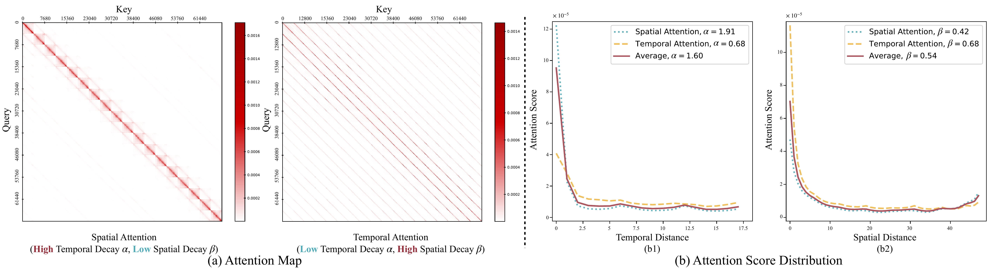

# Long-Horizon Memory vs KV Cache Memory

## Goal

The goal of this document is to clarify the distinction between long-horizon memory and KV cache memory. These two concepts can sound deceptively similar, but they solve different problems in video generation models.

We start with a video generation setting.

Given:

- $I_0$: the conditioning image
- $p$: the caption or text prompt
- $c_{1:T}$: the desired camera trajectory

We want to generate a full video that follows $c_{1:T}$.

Wan 2.2 can generate up to $H$ frames in one cycle. But usually:

```text
H << T
```

So the full video cannot be generated in one call. It must be generated through multiple cycles.

## Motivating Example

Suppose the model has already generated frames up to time $t$. The next chunk can be written as:

$$V_{t+1:t+H} = G_\theta(I_t, c_{t+1:t+H}, p, M_s)$$

Where:

- $V_{t+1:t+H}$ is the next generated video chunk.
- $G_\theta$ is the video generation model.
- $I_t$ is the current conditioning frame.
- $c_{t+1:t+H}$ is the camera trajectory for the next chunk.
- $p$ is the caption.
- $M_s$ is the memory bank.

The hard part is that the camera trajectory may revisit old areas. When that happens, the model needs to preserve identity and scene consistency. A wall, object, character, room layout, or texture that appeared earlier should still look like the same thing later.

This is why we maintain old frames as generation continues. The memory bank $M_s$ carries information across different generation cycles.

The KV cache is different. It is also called memory, **but it works inside a single generation cycle.** It stores intermediate attention information so that the current cycle can run faster.

So the simple distinction is:

```text
M_s helps across generation cycles.
KV cache helps inside one generation cycle.
```

## KV Cache Memory

Continuing the example of video generation, KV cache memory is going to help speed up inference.

Let's assume the model is generating a video chunk of $H$ frames.

$$V_{t+1:t+H} = G_\theta(I_t, c_{t+1:t+H}, p, M_s)$$

This is a single generation cycle. But this generation does not happen in ONE step. Usually it is done over many denoising steps.

Zooming out, we see that the cube of noise this diffusion model is denoising is working at token level. Let's say the model total needs to deal with $N$ tokens in the input.

One important nuance: the clean KV-cache explanation is easiest for an autoregressive transformer. This is the setting papers like PackCache are talking about. Wan-style diffusion models are not always doing simple token-by-token causal decoding in the exact same way. But the main idea still transfers: KV cache is internal acceleration state. It is not a portable scene memory.

For an autoregressive transformer, each token $x_j \in \mathbb{R}^d$ represents a piece of information. The $j$'th token only gets to see tokens up to $j-1$.

During attention:

$$K_j = x_j W_K$$

$$V_j = x_j W_V$$

$$Q_j = x_j W_Q$$

Firstly, let's follow attention's equations:

$$e_{j, k} = \frac{Q_j K^T_k}{\sqrt{d_k}}$$

When we apply softmax to $e_{j, k}$, we get the attention weights:

$$\alpha_{j, k} = \frac{\exp(e_{j, k})}{\sum_{k' < j} \exp(e_{j, k'})}$$

Finally, the output of the attention for token $j$ is:

$$\text{Attention}(Q_j, K, V) = \sum_{k < j} \alpha_{j, k} V_k$$

The KV cache stores the $K$ and $V$ values for all tokens up to $j-1$. This way, when the model processes token $j$, it can quickly retrieve the necessary information from the KV cache without recomputing it for all previous tokens. This significantly speeds up the inference process, especially for long sequences.

A KV cache remembers computation. It does not remember the scene in a human-readable or model-independent way.

## A Useful Decay Figure

This decay figure is useful because it shows the intuition behind many KV-cache compression methods: not every cached token has the same usefulness at every moment.



[Open the original PDF figure](./decay.pdf).

In this kind of plot, attention often decays with distance. Recent tokens can matter more than old tokens. Conditioning tokens, like the text prompt or first image, can also stay important for a long time.

This helps explain why KV-cache compression can work. If the current generation step is mostly using nearby tokens, then some older cached tokens can be compacted or removed.

But this does **not** mean old visual content is useless for long-horizon memory. A wall that gets low attention right now may become important later if the camera loops back to it.

## Long-Horizon Memory

Long-horizon memory is asking a different question.

It is not asking:

```text
Which cached K/V states can make this step faster?
```

It is asking:

```text
Which old visual evidence do I need so future revisits stay consistent?
```

For the camera-trajectory example, the model may leave a room, move somewhere else, and then come back. During the middle part, the old room may not get much attention. But when the camera revisits that room, the model needs to remember what it looked like.

That is why $M_s$ is useful. It can store old frames, old latents, or other scene features. The exact implementation can change. The important point is that $M_s$ is meant to preserve scene evidence across cycles.

## KV Cache Style Storage for Long-Horizon Memory

The question about the usefulness of tokenizing generated frames and storing them in a KV cache style format should be answered explicitly.

The short answer is: nothing stops us mechanically. We could try to store generated frames as patch tokens. We could also try to prune those tokens with a KV-cache-style policy.

But this is usually not a good idea for long-horizon memory.

### Reason 1: KV Cache Tokens Are Not Portable Scene Memory

A KV cache stores internal $K$ and $V$ activations for a specific model state. Those activations are tied to a particular layer, timestep, position encoding, conditioning input, and generation pass.

They are not a clean portable "memory of the room." They are more like temporary machinery the model uses while doing attention.

This is very different from storing an old frame or a decoded latent that can be used again as visual evidence.

### Reason 2: Attention Decay Is Retrospective

KV-cache compression often uses attention as a signal. If a token gets high attention, keep it. If it gets low attention, remove or compress it.

That makes sense when the goal is to speed up the current generation process.

**But long-horizon memory needs a prospective signal. It needs to ask what may become useful later.**

For example, a patch from an old wall may get almost no attention right now. If the camera is currently looking somewhere else, that patch looks useless. But if the camera trajectory later revisits the wall, that same patch becomes important for identity and consistency.

So attention decay is useful for cache compression, but it is not enough for deciding what the scene memory should keep.

### Reason 3: Partial Frame Tokens Are Awkward To Reuse

Suppose we keep only 60% of the patch tokens from an old frame. What exactly do we feed back to the model later?

If we feed those surviving tokens directly, we are giving the model an incomplete spatial grid. That is not the same as giving it a lower-quality frame. It is more like giving it a frame with holes.

If we decode those tokens back through the VAE, we have the same problem. The VAE was trained to decode complete latent grids, not arbitrary missing patch sets. Unless the system is trained for this kind of missing-token input, the output may become artifacted or unstable.

This is the practical reason frame-level memory is attractive. A frame kept whole has clean semantics. It is valid visual evidence. A frame dropped whole is simply absent. But a half-evicted frame is not clearly one thing or the other.

## What PackCache Shows

PackCache is still very relevant. It shows that in autoregressive video generation:

- text and conditioning image tokens can act like persistent anchors
- attention to previous frames can decay with temporal distance
- compacting the KV cache can make generation faster

This is a strong result for KV-cache management.

But it does not collapse the distinction between KV cache and long-horizon memory. PackCache asks:

```text
Which cached K/V tokens can I keep so this rollout is faster?
```

Long-horizon memory asks:

```text
Which old visual evidence must I preserve so future revisits stay consistent?
```

These can both involve tokens. But they optimize different objectives.

## Side-by-Side Comparison

| Question | KV Cache Memory | Long-Horizon Memory |
| --- | --- | --- |
| What is its main purpose? | Speed up inference | Preserve scene consistency |
| What kind of data does it keep? | Internal $K$ and $V$ activations | Frames, latents, features, or scene evidence |
| Where does it operate? | Inside one generation process | Across multiple generation cycles |
| How long does it last? | Usually temporary | Can persist across the full video rollout |
| What signal often controls it? | Recent attention / cache usefulness | Future revisitation / co-visibility / scene utility |
| What does decay mean? | Older cache tokens may be less useful now | Older scene content may still be needed later |
| Is it portable? | Usually no | Ideally yes |
| Main failure mode | Cache grows too large, or useful tokens get pruned | Scene drift, identity loss, inconsistent revisits |

## Final Takeaway

KV cache remembers computation.

Long-horizon memory remembers evidence.

KV-cache style storage can be useful for making a single generation process cheaper. But it is not automatically a good memory bank for long-horizon video generation, because the thing we need to preserve is not just attention state. We need to preserve enough visual evidence for the model to stay consistent when the camera returns to old places.

## References

- Wan Team. [Wan: Open and Advanced Large-Scale Video Generative Models](https://arxiv.org/abs/2503.20314).
- Kunyang Li, Mubarak Shah, Yuzhang Shang. [PackCache: A Training-Free Acceleration Method for Unified Autoregressive Video Generation via Compact KV-Cache](https://arxiv.org/abs/2601.04359).
- Xingyang Li et al. [Radial Attention: $O(n\log n)$ Sparse Attention with Energy Decay for Long Video Generation](https://arxiv.org/abs/2506.19852).
